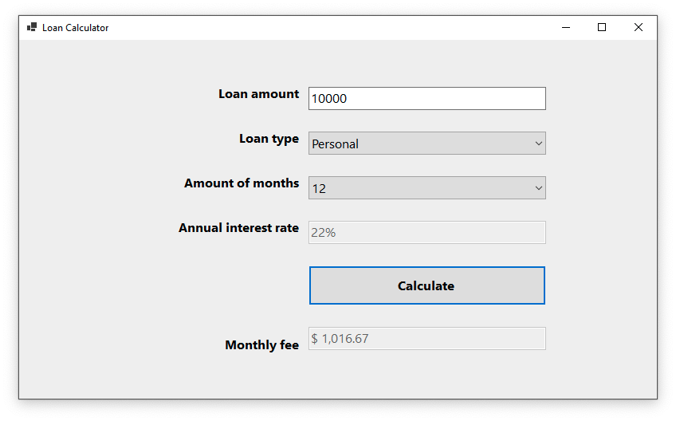

# Loan Calculator

[](https://dotnet.microsoft.com)
[](LICENCE.md)



Basic Winform app of a loan calculator written in .NET Core using OOP.

## Features

- Select three different types of loans.
  - Personal (22% interest).
  - Vehicle (12% interest).
  - Mortage (8% interest).
- Select months of the duration of the loan from 12 to 120 months (step by 6).

## License

```xml
MIT License

Copyright (c) 2021 Anibal Ventura
```
